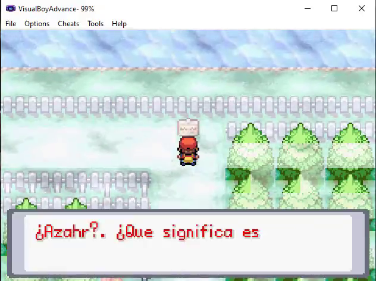
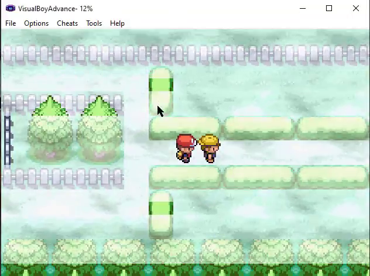
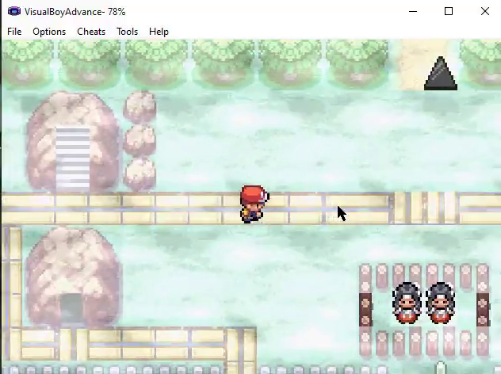
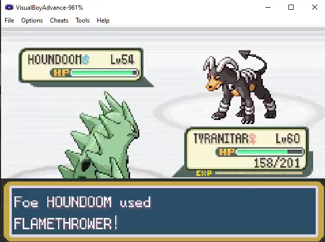
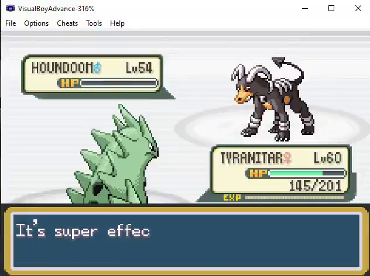
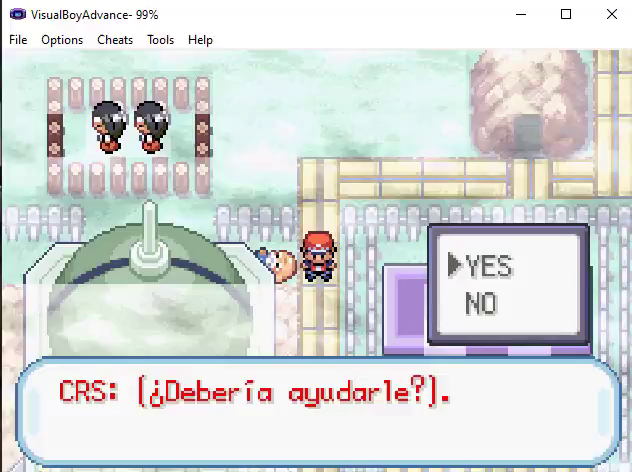
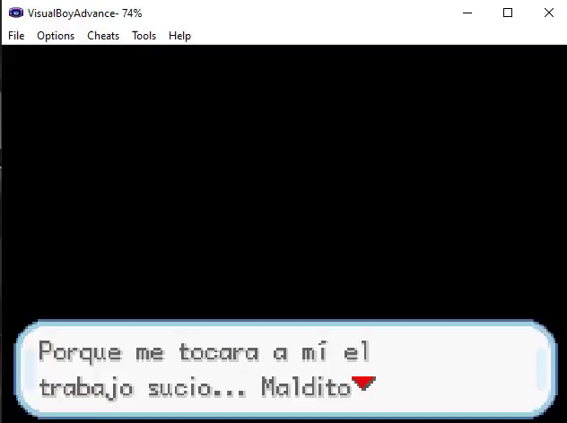
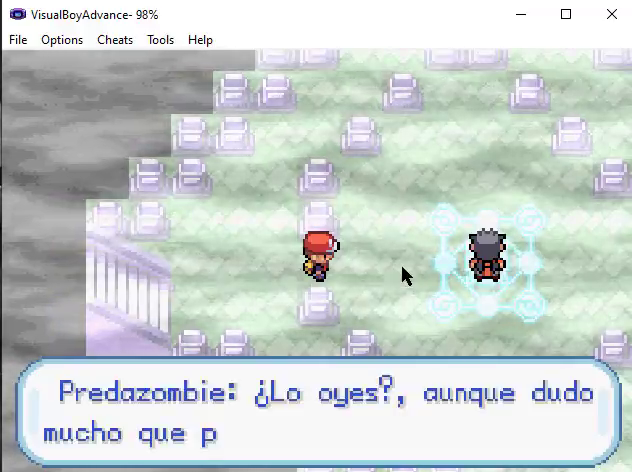

# Pokémon Fight

## Descripción

Pokémon Fight es un fangame desarrollado como proyecto personal que combina el sistema clásico de combate por turnos de Pokémon con una narrativa centrada en el misterio y la toma de decisiones.
El jugador controla a un protagonista que despierta en un lugar desconocido llamado Azahar y termina en un pueblo del que no puede escapar. A medida que explora el entorno, descubre que existe una posible maldición que afecta al lugar y a sus habitantes. El juego introduce un sistema de decisiones que influye en la forma en que el jugador interpreta los eventos y avanza en la historia.
El objetivo principal es investigar lo que está ocurriendo, comprender el origen de la situación y encontrar una forma de escapar, mientras se mantienen mecánicas clásicas como:
Combates por turnos inspirados en los juegos originales
Sistema de exploración basado en mapas
Interacción con NPCs
Narrativa progresiva basada en eventos
Sistema de toma de decisiones con impacto narrativo
Este proyecto ha sido desarrollado utilizando herramientas de edición de ROM y motores específicos de creación de fangames de Pokémon, trabajando sobre elementos como mapas, eventos, scripts y lógica del juego.

---

## Características principales

- Sistema de combate clásico por turnos
- Historia original centrada en el misterio
- Sistema de exploración basado en mapas
- Interacción con NPCs
- Eventos y scripting personalizados
- Sistema narrativo progresivo
- Ambientación inquietante y narrativa inmersiva

---

## Capturas del juego

### Exploración

### Combate

### Eventos y narrativa

---

## Tecnologías y herramientas utilizadas

- ROM base de Pokémon
- Advanced Map
- Herramientas de scripting de eventos
- Edición de tiles y mapas
- Sistema de eventos personalizado
- Diseño narrativo interactivo

---

## Objetivo del proyecto

Este proyecto fue desarrollado con el objetivo de:

- Aprender desarrollo de videojuegos
- Diseñar sistemas narrativos interactivos
- Crear mapas, eventos y lógica de juego
- Comprender la estructura interna de los juegos Pokémon

---

## Estado del proyecto

En desarrollo

---

## Autor

Christian
Desarrollador backend y entusiasta del desarrollo de software y videojuegos
